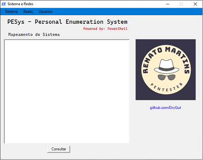

# PESys - Personal Enumeration System

  
 

## Description

This project was made for pratice my skils on powershell
i'm a cybersecurity student so i trying to make my own tools
enumerate a system is the most common thing when search vulnerabilities

## Table of Contents

- [PESys - Personal Enumeration System](#pesys---personal-enumeration-system)
  - [Description](#description)
  - [Table of Contents](#table-of-contents)
  - [Installation](#installation)
  - [Usage](#usage)
  - [Versions](#versions)

## Installation

Just download the .exe file in the release section of the project.
to run in the Windows OS

## Usage

Select the options from the menu bar
the app is friendly use

Current Version. 1.1-beta

## Versions

 
This is the first version made still in the release page(v1.0.0-beta2)

 
This is the current version still in beta release(v.1.1.0-beta)

 
This is how i want to get, trying to fix the icon and logo error in the beta version

